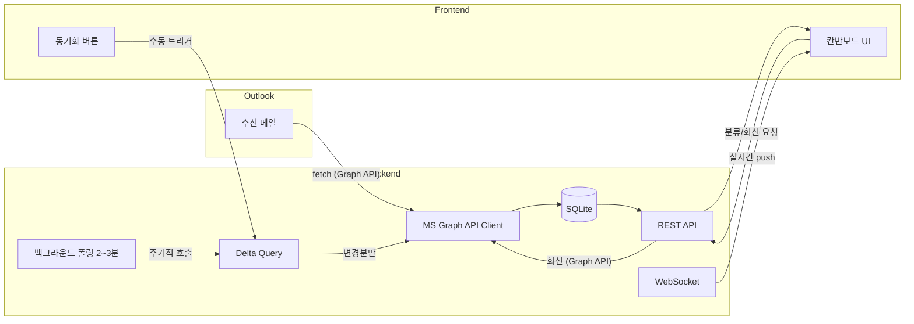
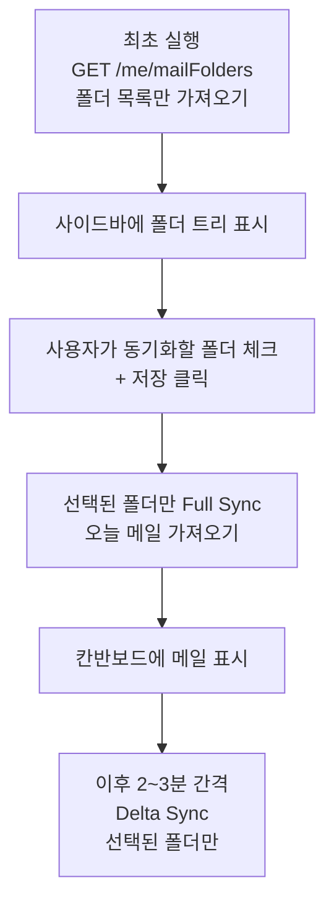
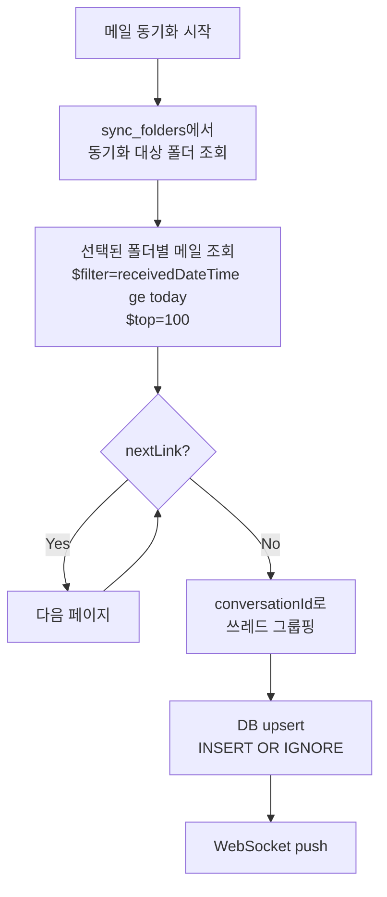
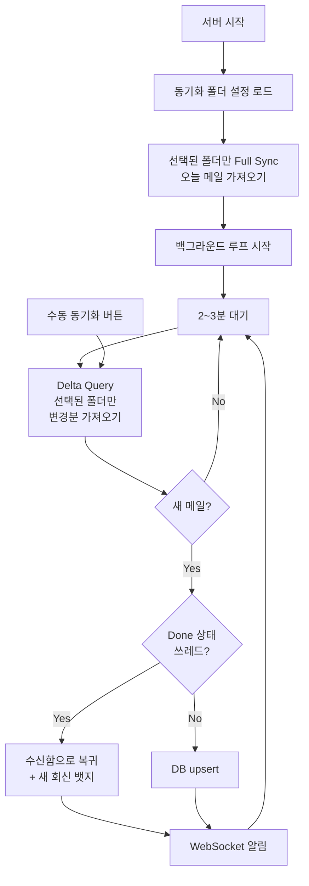
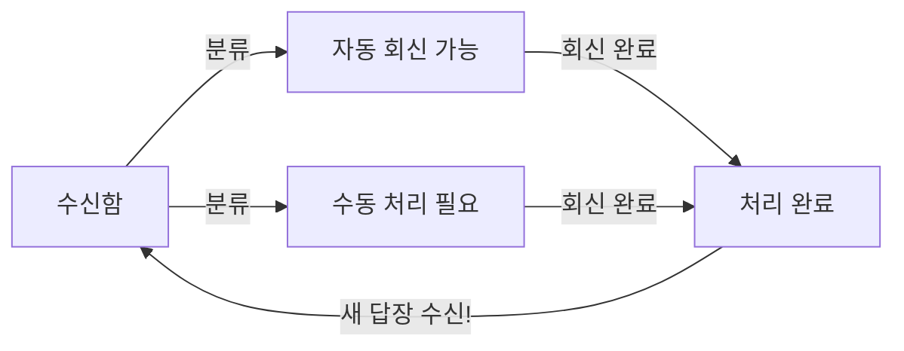

# Outlook 칸반보드 자동 회신 시스템 - 설계 문서

> 최종 목표: AI를 붙여서 메일 자동 답변 시스템 구축
> 현재 단계: Phase 1.5d 완료 — Phase 2 (규칙 기반 분류 + Slack) 진행 예정
> 빌드 완료: 2026-03-25 (Phase 1.5a~d 전체)

---

## 아키텍처 개요



---

## 기술 스택

| 구분 | 기술 |
|------|------|
| Backend | Python 3.11+ / FastAPI / Uvicorn |
| DB | SQLite (aiosqlite, 로컬 파일 기반) |
| HTTP Client | httpx (비동기) |
| 실시간 | WebSocket (FastAPI 내장) |
| Frontend | HTML/CSS/JS + Tailwind CSS + SortableJS |
| 메일 연동 | Microsoft Graph API (OAuth2) |
| 환경 관리 | pydantic-settings / python-dotenv |

---

## 프로젝트 구조

```
autoReply/
├── .cursor/rules/            # Cursor AI 규칙
│   └── plan-documentation.mdc
├── docs/plan/                # 설계 문서 (plan 논의 시 자동 저장)
│   └── PLAN.md
├── setup.sh                  # 가상환경 생성 + 의존성 설치 스크립트
├── requirements.txt          # Python 의존성
├── .env.example              # 환경변수 템플릿
├── .env                      # 실제 환경변수 (git 제외)
├── .gitignore
├── main.py                   # FastAPI 진입점
├── app/
│   ├── __init__.py
│   ├── config.py             # Settings (pydantic-settings)
│   ├── database.py           # SQLite + aiosqlite 연결
│   ├── routers/
│   │   ├── __init__.py
│   │   ├── emails.py         # 메일 CRUD + 분류 변경 API
│   │   └── auth.py           # MS Graph OAuth2 토큰 관리
│   ├── services/
│   │   ├── __init__.py
│   │   └── outlook.py        # MS Graph API 연동 (메일 조회/회신)
│   └── models/
│       ├── __init__.py
│       └── schemas.py        # Pydantic 스키마
├── static/
│   ├── index.html            # 칸반보드 메인 페이지
│   ├── css/
│   │   └── style.css         # 커스텀 스타일
│   └── js/
│       └── kanban.js         # 칸반보드 로직 (드래그앤드롭)
└── data/
    └── emails.db             # SQLite DB 파일
```

---

## 1. 가상환경 및 프로젝트 셋업

`setup.sh` 스크립트 하나로 가상환경 생성부터 의존성 설치까지 자동화:

- `python -m venv venv` 로 가상환경 생성
- `pip install -r requirements.txt` 로 의존성 설치
- `.env.example` → `.env` 복사 (없을 경우)
- Windows(Git Bash) 환경 고려하여 `source venv/Scripts/activate` 사용

---

## 2. Microsoft Graph API 연동

### 인증 정보

- **Client ID**: `c82cb0ff-6093-4bcd-a654-18942bdf5e8d`
- **Tenant**: `nexon.co.kr`
- **인증 방식**: Public Client + Authorization Code Flow (client_secret 불필요)
  - `CLIENT_SECRET` 없이 동작 → Azure Portal에서 "공개 클라이언트 흐름 허용: 예" 설정 필요
  - refresh token으로 access token 자동 갱신 (1시간 단위, 최대 90일)
  - 로그인 흐름: `GET /api/auth/login` → Microsoft 로그인 → `GET /api/auth/callback` → SQLite 저장

### Azure Portal 설정 (1회)

앱 등록(`c82cb0ff-...`) → **인증(Authentication)** 탭:
1. "모바일 및 데스크톱 애플리케이션" 플랫폼 추가 OR **"공개 클라이언트 흐름 허용" → 예**
2. 리디렉션 URI에 `http://localhost:8000/api/auth/callback` 추가

### 메일 수신 전략

- Outlook 규칙으로 폴더 자동 분류 중 → **사용자가 선택한 폴더만** 동기화
- 오늘 하루치만 필터링: `$filter=receivedDateTime ge {오늘 00:00 UTC}`
- 한번에 최대 100건씩, `@odata.nextLink`로 페이지네이션하여 전체 수집
- 폴더명을 메일별 메타데이터로 포함

### 폴더 선택 후 동기화 시작

최초 실행 시 메일을 바로 가져오지 않고, 폴더 목록만 가져온 뒤 사용자가 동기화 대상을 선택한다.



- atlasAlert, temp, M365, Slack 등 알림 폴더를 제외하면 메일 수 대폭 감소
- 폴더 선택 설정은 `sync_folders` 테이블에 저장 (서버 재시작 시 유지)

### Graph API 호출 흐름



### 실시간 동기화 전략



- **최초 시작**: 폴더 목록만 가져오고, 사용자가 동기화 폴더 선택 후 Full Sync
- **이후 (Delta Sync)**: `GET /me/mailFolders/{id}/messages/delta` 로 선택된 폴더만 변경분 가져옴
  - `deltaLink` 토큰을 DB에 저장하여 다음 호출에 사용
- **백그라운드 폴링**: `asyncio.create_task` 로 2~3분 간격 자동 delta sync
- **수동 동기화**: UI 버튼으로 즉시 delta sync 트리거
- **WebSocket**: 새 메일 감지 시 프론트엔드에 실시간 push

### 중복 방지

회신 전송 시 Graph API가 반환하는 새 메일 ID를 즉시 DB에 저장.
이후 delta sync에서 같은 메일을 감지해도 `INSERT OR IGNORE`로 자동 무시.

---

## 3. UI 디자인

### 디자인 시스템 (Tower 참고)

- **다크 테마**: 배경 `#0f0f1a` ~ `#1a1a2e`, 카드 `#1e1e32` ~ `#2a2a3e`
- **텍스트**: 제목 `#ffffff`, 본문 `#a0a0b8`, 보조 `#6b6b80`
- **액센트 컬러**:
  - 수신함: 파랑 `#3b82f6`
  - 자동 회신 가능: 초록 `#22c55e`
  - 수동 처리 필요: 주황 `#f59e0b`
  - 처리 완료: 회색 `#6b7280`
- **카드**: 둥근 모서리(8px), hover 시 밝기 변화, 좌측 컬러 바(상태별)
- **폰트**: Inter 또는 시스템 산세리프

### 상단바 (인증 상태 표시)

```
인증 안 됨:
+-------------------------------------------------------------------------+
| Mail Kanban                                  [Microsoft로 로그인 ->]    |
+-------------------------------------------------------------------------+

인증 완료:
+-------------------------------------------------------------------------+
| Mail Kanban              [O] dominic@nexon.co.kr (도미닉)  [동기화 14:32] |
+-------------------------------------------------------------------------+
```

- 로그인 전: "Microsoft로 로그인" 버튼만 표시
- 로그인 후: 프로필 사진(또는 이니셜 아바타) + 이름 + 이메일 + 녹색 점(연결됨)
- Graph API `GET /me` 로 프로필 정보 조회 (displayName, mail)
- Graph API `GET /me/photo/$value` 로 프로필 사진 조회
- 마지막 동기화 시간 표시

### 전체 레이아웃

```
+-- 사이드바 ----------+------------ 메인 칸반 영역 --------------------+
| 동기화 폴더 설정      | 수신함 (12) | 자동회신 (3) | 수동처리 (5) | 완료 |
|                      |            |             |             |       |
| [v] 받은편지함    (4) | +--------+ | +--------+  | +--------+  | +---+ |
|   [v] 업무 관리       | | 카드    | | | 카드    |  | | 카드    |  | |카드| |
|   [ ] AI tools    (6) | +--------+ | +--------+  | +--------+  | +---+ |
|   [ ] atlasAlert (10) |            |             |             |       |
|   [ ] temp      (177) | +--------+ |             |             |       |
|   [v] 사내IT팀   (23) | | 카드    | |             |             |       |
|   [v] 업무요청   (37) | +--------+ |             |             |       |
|   [ ] M365      (301) |            |             |             |       |
| [v] Jira         (78) |            |             |             |       |
| [v] Notion       (27) |            |             |             |       |
| [ ] Slack        (32) |            |             |             |       |
|                      |            |             |             |       |
| [전체 선택] [전체 해제]|            |             |             |       |
| [설정 저장]           |            |             |             |       |
| -------------------- |            |             |             |       |
| 동기화: 14:32         |            |             |             |       |
| [수동 동기화]         |            |             |             |       |
+----------------------+------------+-------------+-------------+-------+
```

### 칸반 카드 디자인

```
+-- [상태 컬러바] ----------------------------+
| RE: Q2 마케팅 예산 검토 요청                 |  <- 제목 (볼드, 흰색)
|                                             |
| 김철수 (kim@nexon.co.kr)                    |  <- 발신자
| 예산 관련 자료를 첨부합니다...               |  <- 미리보기 (회색, 1줄)
|                                             |
| [프로젝트-A] [4] [첨부]           14:32     |  <- 폴더뱃지, 쓰레드수, 시간
| [새 회신]                                   |  <- Done 복귀 시 표시
+---------------------------------------------+
```

### 카드 클릭 → 상세 패널 (오른쪽 슬라이드)

카드 클릭 시 오른쪽에서 슬라이드 패널이 열림 (칸반보드는 좌측으로 축소):

```
+--- 칸반 (축소) ---+------------ 상세 패널 (슬라이드) --------------------+
| 수신함 | 자동 | ...| [<- 닫기]                   [상태: 수신함 v] [메뉴] |
|        |      |    |                                                    |
| 카드   | 카드  |    | RE: Q2 마케팅 예산 검토 요청                        |
| 카드   |      |    | [프로젝트-A] 4건의 메시지 / 2개 첨부                 |
| 카드>  |      |    |                                                    |
|        |      |    | ---- 쓰레드 타임라인 -------------------------------- |
|        |      |    |                                                    |
|        |      |    | +-- 수신 ------------------------------------------+ |
|        |      |    | | 김철수 (kim@nexon.co.kr)        03/25 09:30      | |
|        |      |    | | CC: 박지민, 이수진                               | |
|        |      |    | |                                                 | |
|        |      |    | | 안녕하세요,                                      | |
|        |      |    | | Q2 마케팅 예산 관련 검토를 요청드립니다.           | |
|        |      |    | |                                                 | |
|        |      |    | | [첨부: Q2_예산안.xlsx]                            | |
|        |      |    | +--------------------------------------------------+ |
|        |      |    |                                                    |
|        |      |    |     +-- 발신 (나) --------------------------------+ |
|        |      |    |     | 나 -> 김철수               03/25 10:15      | |
|        |      |    |     | CC: 박지민, 이수진                          | |
|        |      |    |     |                                             | |
|        |      |    |     | 확인했습니다. 수정 의견 전달드립니다.         | |
|        |      |    |     +----------------------------------------------+ |
|        |      |    |                                                    |
|        |      |    | +-- 수신 [NEW] ------------------------------------+ |
|        |      |    | | 김철수 (kim@nexon.co.kr)        03/25 14:30      | |
|        |      |    | | CC: 박지민                                       | |
|        |      |    | | (!) 이수진 제거됨                                | |
|        |      |    | |                                                 | |
|        |      |    | | 수정 의견 감사합니다. 반영하여 재첨부합니다.       | |
|        |      |    | |                                                 | |
|        |      |    | | [첨부: Q2_예산안_v2.xlsx]                         | |
|        |      |    | +--------------------------------------------------+ |
|        |      |    |                                                    |
|        |      |    | ---- 회신 작성 -------------------------------------- |
|        |      |    | +--------------------------------------------------+ |
|        |      |    | | [답장 v]   답장 / 전체답장 / 전달                  | |
|        |      |    | |                                                  | |
|        |      |    | | 받는 사람: [kim@nexon.co.kr x]         [+ 추가]   | |
|        |      |    | | 참조(CC):  [park@nexon.co.kr x]        [+ 추가]   | |
|        |      |    | | 숨은참조:                              [+ 추가]   | |
|        |      |    | |                                                  | |
|        |      |    | | 회신 내용을 입력하세요...                         | |
|        |      |    | |                                                  | |
|        |      |    | |                                [첨부] [전송 ->]  | |
|        |      |    | +--------------------------------------------------+ |
+------------------+------------------------------------------------------+
```

### 상세 패널 구성 요소

**헤더:**
- 제목, 닫기 버튼, 상태 드롭다운(칸반 이동과 동일), 메뉴

**메타 정보:**
- 폴더명 뱃지, 쓰레드 메시지 수, 첨부파일 수

**쓰레드 타임라인:**
- 시간순으로 모든 메일 표시
- 수신 메일: 좌측 정렬, 파란 테두리
- 발신 메일(내가 보낸): 우측 정렬, 초록 테두리
- 각 메일에 발신자, 수신자(To/CC), 시간, 본문, 첨부파일 표시
- 수신자 변경 시 diff 표시 (누가 추가/제거됐는지)
- 새 메일은 [NEW] 뱃지

**회신 작성 영역 (하단 고정):**
- 답장 / 전체답장 / 전달 드롭다운
- 받는 사람(To) / 참조(CC) / 숨은참조(BCC) 필드
  - 최신 메일 기준으로 수신자 자동 채움
  - 타이핑 시 Graph API `/me/people` 자동완성 (회사 주소록)
  - 태그 칩 형태, [x]로 제거, [+ 추가]로 추가
- 수신자 변경 시 전송 전 확인 팝업 (추가/제거된 사람 diff 표시)
- 받는 사람 0명이면 전송 버튼 비활성화
- 텍스트 입력 + 첨부 + 전송 버튼

---

## 4. 칸반보드 동작 규칙

### 칸반 컬럼 (4개)

| 컬럼 | 색상 바 | 설명 |
|------|--------|------|
| **수신함** | 파랑 | 새로 가져온 메일 (미분류) |
| **자동 회신 가능** | 초록 | 자동 회신할 수 있다고 판단된 메일 |
| **수동 처리 필요** | 주황 | 사람이 직접 처리해야 하는 메일 |
| **처리 완료** | 회색 | 회신 완료된 메일 |

### 상태 전이 규칙



- 드래그앤드롭으로 수동 분류 (SortableJS)
- 상세 패널의 상태 드롭다운으로도 이동 가능
- "Done" 상태에서 새 답장 수신 시 자동으로 "수신함"으로 복귀 + "새 회신" 뱃지

### 쓰레드 티켓 구조

- **칸반 카드 1개 = 대화 쓰레드 1개** (`conversationId`로 그룹핑)
- 같은 대화의 답장은 모두 하나의 카드에 소속
- 몇백 통의 메일도 쓰레드로 그룹핑되어 카드 수 대폭 감소

### 폴더 불일치 감지 + 양방향 싱크

쓰레드 내 메일들이 서로 다른 폴더에 있으면 경고 표시:

```
카드 표시:
[프로젝트-A] [⚠️ temp +1]  ← 1건이 다른 폴더에 있음

상세 패널에서:
+-- ⚠️ 폴더 불일치 알림 -----------------------------------+
|                                                          |
| 이 쓰레드의 메일이 여러 폴더에 흩어져 있습니다:            |
|   프로젝트-A: 2건                                        |
|   temp: 1건                                              |
|                                                          |
| 모든 메일을 어디로 이동할까요?                             |
|                                                          |
|  [프로젝트-A로 전체 이동]  [temp로 전체 이동]  [무시]       |
+----------------------------------------------------------+
```

**"전체 이동" 클릭 시:**
1. Graph API로 해당 conversationId의 **모든 메일 조회** (DB에 없는 과거 메일 포함)
   - `GET /me/messages?$filter=conversationId eq 'xxx'`
2. 대상 폴더에 없는 메일만 `POST /me/messages/{id}/move` 호출
3. Outlook에서도 실제 이동됨 (양방향 싱크)
4. DB 업데이트 → 경고 사라짐

이 방식으로 DB에는 오늘치만 가볍게 유지하면서, 폴더 이동이 필요한 순간에만 conversationId로 전체 조회하여 처리한다.

### 데이터 조회 전략

| 상황 | 데이터 소스 | 이유 |
|------|------------|------|
| 칸반 카드 목록 | DB (오늘치만) | 빠른 응답, 가벼운 DB |
| 카드 클릭 → 상세 패널 | Graph API 온디맨드 조회 | 과거 히스토리 포함한 전체 쓰레드 |
| 폴더 전체 이동 | Graph API 온디맨드 조회 → move | 몇 년치 메일까지 전부 처리 |
| 칸반 상태 변경 | DB만 업데이트 | Outlook 폴더와 무관한 우리 자체 분류 |

---

## 5. API 엔드포인트 설계

| Method | Endpoint | 설명 |
|--------|----------|------|
| GET | `/api/auth/login` | Microsoft OAuth 로그인 페이지로 리다이렉트 |
| GET | `/api/auth/callback` | OAuth 콜백 (code → token 교환 → DB 저장) |
| GET | `/api/auth/me` | 현재 로그인된 사용자 프로필 (이름, 이메일, 사진) |
| POST | `/api/auth/token` | refresh token으로 access token 발급/갱신 |
| POST | `/api/emails/sync` | Outlook에서 메일 동기화 (full/delta) |
| WS | `/ws` | 새 메일/새 회신 실시간 push 채널 |
| GET | `/api/folders` | 전체 폴더 목록 조회 (트리 구조) |
| PATCH | `/api/folders/{folder_id}/sync` | 폴더 동기화 ON/OFF 설정 |
| GET | `/api/threads` | 쓰레드(티켓) 목록 조회 (status 필터) |
| GET | `/api/threads/{conversation_id}` | 쓰레드 상세 조회 (Graph API로 전체 히스토리 온디맨드 조회) |
| PATCH | `/api/threads/{conversation_id}/status` | 쓰레드 상태 변경 (드래그앤드롭) |
| POST | `/api/threads/{conversation_id}/reply` | 메일 회신 전송 |
| POST | `/api/threads/{conversation_id}/move` | 쓰레드 전체 메일 폴더 이동 (양방향 싱크) |
| GET | `/api/people/search?q={query}` | 수신자 자동완성 (Graph API /me/people) |

---

## 6. 데이터 모델

### SQLite 테이블 구조

```sql
-- 쓰레드 (칸반 카드 = 티켓)
CREATE TABLE threads (
    conversation_id TEXT PRIMARY KEY,
    subject         TEXT,
    status          TEXT DEFAULT 'inbox',    -- inbox / auto_reply / manual / done
    latest_at       DATETIME,               -- 가장 최근 메일 시간
    has_new_reply   BOOLEAN DEFAULT 0,      -- Done 복귀 시 표시
    created_at      DATETIME DEFAULT CURRENT_TIMESTAMP
);
-- folder_name은 threads에 없음 → messages에서 메일별로 추적

-- 개별 메일 (쓰레드에 소속)
CREATE TABLE messages (
    id              TEXT PRIMARY KEY,       -- Graph API message ID (중복 방지 핵심)
    conversation_id TEXT REFERENCES threads(conversation_id),
    folder_id       TEXT,                   -- Outlook 폴더 ID
    folder_name     TEXT,                   -- Outlook 폴더명 (메일별 추적)
    sender          TEXT,
    sender_email    TEXT,
    to_recipients   TEXT,                   -- JSON: [{name, email}, ...]
    cc_recipients   TEXT,                   -- JSON: [{name, email}, ...]
    received_at     DATETIME,
    body_preview    TEXT,
    body            TEXT,
    is_read         BOOLEAN,
    has_attachments BOOLEAN,
    is_from_me      BOOLEAN DEFAULT 0,
    created_at      DATETIME DEFAULT CURRENT_TIMESTAMP
);

-- 동기화 대상 폴더 관리
CREATE TABLE sync_folders (
    folder_id   TEXT PRIMARY KEY,           -- Outlook 폴더 ID
    folder_name TEXT,                       -- 폴더 표시명
    parent_id   TEXT,                       -- 상위 폴더 (트리 구조용)
    is_synced   BOOLEAN DEFAULT 0,          -- 동기화 대상 여부 (사용자 선택)
    mail_count  INTEGER DEFAULT 0           -- 폴더 내 메일 수
);

-- delta sync 상태 추적
CREATE TABLE sync_state (
    folder_id   TEXT PRIMARY KEY,
    delta_link  TEXT,
    last_sync   DATETIME
);

-- 토큰 관리
CREATE TABLE auth_tokens (
    id              INTEGER PRIMARY KEY DEFAULT 1,
    access_token    TEXT,
    refresh_token   TEXT,
    expires_at      DATETIME
);
```

### Pydantic 스키마

```python
class EmailStatus(str, Enum):
    INBOX = "inbox"
    AUTO_REPLY = "auto_reply"
    MANUAL = "manual"
    DONE = "done"

class Recipient(BaseModel):
    name: str
    email: str

class MessageSchema(BaseModel):
    id: str
    conversation_id: str
    folder_id: str
    folder_name: str
    sender: str
    sender_email: str
    to_recipients: list[Recipient]
    cc_recipients: list[Recipient]
    received_at: datetime
    body_preview: str
    body: str
    is_read: bool
    has_attachments: bool
    is_from_me: bool

class ThreadSchema(BaseModel):
    conversation_id: str
    subject: str
    status: EmailStatus
    primary_folder: str          # 첫 번째 메일의 폴더 (대표 폴더)
    has_folder_mismatch: bool    # 쓰레드 내 폴더 불일치 여부
    latest_at: datetime
    has_new_reply: bool
    message_count: int
    messages: list[MessageSchema]  # 상세 조회 시

class ReplyRequest(BaseModel):
    body: str
    to_recipients: list[Recipient]
    cc_recipients: list[Recipient] = []
    bcc_recipients: list[Recipient] = []

class FolderMoveRequest(BaseModel):
    destination_folder_id: str   # 이동할 대상 폴더
```

---

## 7. 수신자 처리 규칙

### 회신 시 수신자 자동 채우기

- **항상 쓰레드의 최신 메일 기준**으로 수신자 자동 설정
- 답장: 최신 메일 발신자에게만
- 전체답장: 최신 메일 발신자 + CC 전체
- 전달: 수신자 비어있음 (직접 입력)

**최신 메일이 "내가 보낸 메일"인 경우:**

```
메일 1: 김철수 → 나 (CC: 박지민)       ← 수신
메일 2: 나 → 김철수 (CC: 박지민)       ← 발신 (이게 마지막)

회신 클릭 시: 받는 사람 = 김철수, CC = 박지민  ← 내가 보냈던 수신자 기준
```

받은 메일이든 보낸 메일이든 마지막 메일의 수신자 구조를 따르면 자연스럽게 동작한다.

### 수신자 변경 감지

쓰레드 타임라인에서 이전 메일 대비 수신자가 변경되면 표시:
- 추가된 사람: `(+) 최현우 추가됨`
- 제거된 사람: `(!) 이수진 제거됨`

### 전송 전 안전장치

- 받는 사람 0명 → 전송 버튼 비활성화
- 원래 수신자에서 변경 있으면 → 확인 팝업 (추가/제거 diff 표시)
- 변경 없으면 → 바로 전송

**확인 팝업 예시:**

```
+-- 수신자 변경 알림 -----------------------------------------+
|                                                             |
| 원래 수신자에서 변경사항이 있습니다:                          |
|                                                             |
|  (x) 제거됨: park@nexon.co.kr (박지민)                      |
|  (x) 제거됨: lee@nexon.co.kr (이수진)                       |
|  (+) 추가됨: choi@nexon.co.kr (최현우)                      |
|                                                             |
| 이대로 전송하시겠습니까?                                     |
|                                                             |
|                             [취소]  [확인 후 전송]            |
+-------------------------------------------------------------+
```

### 수신자 검색 자동완성

- Graph API `/me/people?$search="검색어"` 활용
- 자주 연락한 사람 우선 노출
- 회사 주소록(GAL) 검색 포함
- 직접 이메일 주소 입력도 가능

**자동완성 UI:**

```
받는 사람: [kim@nexon.co.kr x] [park                ]
                                +----------------------+
                                | park                 |
                                | -------------------- |
                                | 박지민 (park@nexon...) |
                                | 박서준 (parks@nexon..)|
                                | 박현수 (parkh@nexon..)|
                                +----------------------+
```

- 타이핑 시작 → 자동완성 드롭다운 표시
- 클릭 또는 Enter → 태그 칩으로 추가
- 이메일 주소 풀로 입력 후 Enter → 직접 추가도 가능

---

## 로드맵

### Phase 1 (현재) - 기본 기능

- [x] 컨셉 설계 완료
- [x] 가상환경 셋업 스크립트 (`setup.sh`)
- [x] MS Graph API 토큰 관리 + Public Client 인증 (client_secret 불필요)
- [x] 폴더 목록 조회 + 동기화 대상 선택 UI (사이드바 체크박스)
- [x] 선택된 폴더만 메일 동기화 (Full Sync + Delta Sync)
- [x] conversationId로 쓰레드 그룹핑
- [x] 칸반보드 UI (다크 테마, 드래그앤드롭 SortableJS)
- [x] 카드 클릭 상세 패널 (Graph API 온디맨드 전체 쓰레드 조회)
- [x] 상세 패널에서 회신 전송 (To/CC/BCC + 자동완성 + 안전장치)
- [x] 폴더 불일치 감지 + 양방향 싱크 (전체 이동)
- [x] 백그라운드 폴링 (2~3분) + 수동 동기화 + WebSocket 실시간 push
- [x] "Done" 카드 새 회신 시 자동 복귀 + 뱃지
- [x] 상단바 프로필 표시 (이름, 이메일, 프로필 사진, 연결 상태)

> Azure Portal 설정 1회 필요: 공개 클라이언트 흐름 허용 + redirect URI 등록

### Phase 2 - 규칙 기반 자동 분류

- [ ] 발신자 기반 분류 규칙
- [ ] 키워드/제목 패턴 기반 분류
- [ ] 폴더명 기반 매핑 (Outlook 규칙 활용)
- [ ] 분류 규칙 관리 UI

### Phase 3 - AI 자동 답변 (최종 목표)

- [ ] LLM 연동 (메일 내용 분석)
- [ ] 자동 분류 (AI 기반)
- [ ] 회신 초안 자동 생성
- [ ] 자동 답변 전송 (승인 후)

---

## 설계 결정 기록

| 날짜 | 결정 사항 | 이유 |
|------|----------|------|
| 2026-03-25 | Python FastAPI 선택 | 빠른 프로토타이핑, 비동기 지원 |
| 2026-03-25 | SQLite 로컬 DB | 서버 설치 불필요, 파일 기반, 프로토타입에 적합 |
| 2026-03-25 | 오늘 하루치만 동기화 | 메일 볼륨 관리 (하루 수백 통) |
| 2026-03-25 | conversationId 쓰레드 그룹핑 | 카드 수 감소 + 히스토리 관리 |
| 2026-03-25 | Delta Query + 폴링 | 실시간성 확보 + 공개 엔드포인트 불필요 |
| 2026-03-25 | 최신 메일 기준 수신자 자동 채움 | Outlook 네이티브 동작과 동일 |
| 2026-03-25 | Message ID 기반 중복 방지 | 회신 전송 후 delta sync 중복 차단 |
| 2026-03-25 | Tower UI 다크 테마 참고 | 깔끔한 칸반보드 레퍼런스 |
| 2026-03-25 | 폴더 선택 후 동기화 시작 | 30+개 폴더 전부 동기화하면 API 호출 과다 |
| 2026-03-25 | folder_name을 messages로 이동 | 쓰레드 내 메일이 다른 폴더에 있을 수 있음 |
| 2026-03-25 | 양방향 폴더 싱크 | Outlook ↔ 서비스 간 폴더 이동 동기화 |
| 2026-03-25 | conversationId 온디맨드 조회 | DB에는 오늘치만, 필요 시 Graph API로 전체 조회 |
| 2026-03-25 | 상단바 프로필 표시 | 인증 상태 + 사용자 정보를 한눈에 확인 |
| 2026-03-25 | Public Client flow (client_secret 불필요) | Azure 앱 등록에서 공개 클라이언트 허용 시 secret 없이 동작, 로컬 개발 편의성 |
